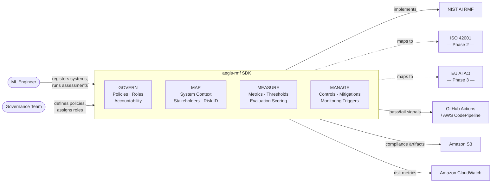

# aegis-rmf

**Governance-as-code toolkit mapping AI regulatory frameworks to technical controls.**

Aegis RMF is an open-source Python SDK for ML engineers and governance teams who need to operationalize AI risk management — not just read about it. It maps NIST AI RMF, ISO 42001, and the EU AI Act to concrete data models, assessments, and controls you can wire into CI/CD pipelines and monitoring systems.


> **Status:** Pre-alpha — Phase 1 (NIST AI RMF foundation) in active development. GOVERN, MAP, MEASURE, and MANAGE functions complete.

---

## Why this exists

Most AI governance tooling lives in spreadsheets, policy PDFs, and consultants' decks. Aegis RMF treats governance as code: versioned, testable, and integrated into the same engineering workflows teams already use. The goal is to make compliance a byproduct of good engineering practice, not a separate audit exercise.

---

## Context



---

## Quick start

```bash
# Install
uv sync --extra dev

# Run the test suite
uv run pytest -v
```

### Evaluate governance policies against an AI system

```python
from aegis_rmf.core import LifecycleStage, PolicyStatus, RiskLevel, SystemType
from aegis_rmf.core import AISystem
from aegis_rmf.govern import GovernancePolicy, GovernService, PolicyCondition

# Define a policy that targets high-risk production systems
policy = GovernancePolicy(
    name="High Risk Controls",
    description="Extra controls required for high-risk production systems",
    status=PolicyStatus.ACTIVE,
    condition=PolicyCondition(
        risk_levels=[RiskLevel.HIGH, RiskLevel.CRITICAL],
        lifecycle_stages=[LifecycleStage.PRODUCTION],
    ),
    requirements=["Monthly risk assessment", "Human-in-the-loop review"],
    owner="Risk Team",
)

# Register the policy with the service
service = GovernService()
service.add_policy(policy)

# Check which policies apply to a given system
system = AISystem(
    name="Fraud Detector",
    description="Flags suspicious transactions in real time",
    system_type=SystemType.CLASSIFICATION,
    owner="ML Platform Team",
    lifecycle_stage=LifecycleStage.PRODUCTION,
    risk_level=RiskLevel.HIGH,
)

applicable = service.get_applicable_policies(system)
for p in applicable:
    print(f"{p.name}: {p.requirements}")
# High Risk Controls: ['Monthly risk assessment', 'Human-in-the-loop review']
```

### Map system context, stakeholders, and risks

```python
from aegis_rmf.core import (
    AISystem,
    DataSensitivity,
    DeploymentEnvironment,
    RiskCategory,
    RiskLevel,
    StakeholderType,
    SystemType,
)
from aegis_rmf.map import DataSource, IdentifiedRisk, MapService, Stakeholder, SystemContext

system = AISystem(
    name="Fraud Detector",
    description="Flags suspicious transactions in real time",
    system_type=SystemType.CLASSIFICATION,
    owner="ML Platform Team",
)

# Capture operational context — purpose, environment, and data sources
context = SystemContext(
    system_id=system.id,
    purpose="Detect fraudulent payment transactions before they settle",
    intended_use="Real-time scoring of payment events",
    out_of_scope_uses=["Credit decisioning", "Know-your-customer checks"],
    deployment_environment=DeploymentEnvironment.CLOUD_PUBLIC,
    data_sources=[
        DataSource(
            name="Transaction history",
            description="12 months of card transactions",
            sensitivity=DataSensitivity.CONFIDENTIAL,
            contains_pii=True,
        )
    ],
    dependencies=["AWS Bedrock", "Internal feature store"],
)

# Map the stakeholders affected by this system
stakeholder = Stakeholder(
    system_id=system.id,
    name="Cardholders",
    stakeholder_type=StakeholderType.DATA_SUBJECT,
    description="Individuals whose transactions are scored",
    impact_description="May have legitimate transactions declined",
)

# Identify granular risks, then aggregate into a RiskProfile
service = MapService()
service.add_risk(IdentifiedRisk(
    system_id=system.id,
    category=RiskCategory.BIAS,
    level=RiskLevel.HIGH,
    title="Demographic skew in training data",
    description="Lower precision for transactions in certain geographic regions",
    affected_stakeholders=[stakeholder.id],
))
service.add_risk(IdentifiedRisk(
    system_id=system.id,
    category=RiskCategory.PRIVACY,
    level=RiskLevel.MEDIUM,
    title="PII in feature pipeline",
    description="Raw card numbers passed through feature store",
))

profile = service.build_risk_profile(system.id, context="Pre-deployment MAP assessment")
print(profile.overall_risk)   # RiskLevel.HIGH
print(profile.risk_scores)    # {RiskCategory.BIAS: HIGH, RiskCategory.PRIVACY: MEDIUM}
```

### Manage risks with controls, actions, and monitoring triggers

```python
from datetime import datetime

from aegis_rmf.core import (
    ActionStatus,
    ControlStatus,
    EvaluationResult,
    RiskCategory,
    RiskLevel,
    SystemType,
)
from aegis_rmf.core import AISystem
from aegis_rmf.map import IdentifiedRisk
from aegis_rmf.manage import Control, ManageService, MitigationAction, MonitoringTrigger
from aegis_rmf.measure import Metric, MetricType

system = AISystem(
    name="Fraud Detector",
    description="Flags suspicious transactions in real time",
    system_type=SystemType.CLASSIFICATION,
    owner="ML Platform Team",
)

# Register a control that addresses bias risk
control = Control(
    system_id=system.id,
    name="Demographic parity constraint",
    description="Post-hoc fairness calibration applied at inference time",
    status=ControlStatus.ACTIVE,
    categories=[RiskCategory.BIAS],
)

# A high-severity bias risk from the MAP function
risk = IdentifiedRisk(
    system_id=system.id,
    category=RiskCategory.BIAS,
    level=RiskLevel.HIGH,
    title="Demographic skew in training data",
    description="Lower precision for transactions in certain geographic regions",
)

service = ManageService()
service.register_control(control)

# Derive priority from risk level, then open a mitigation action
service.add_action(MitigationAction(
    system_id=system.id,
    risk_id=risk.id,
    control_id=control.id,
    title="Deploy fairness calibration to prod",
    priority=ManageService.priority_for_risk_level(risk.level),  # → SHORT_TERM
    assignee="ml-platform@example.com",
    due_date=datetime(2026, 5, 1),
    description="Apply post-processing calibration step in SageMaker pipeline",
))

# Add a monitoring trigger — fire when the bias metric hits WARNING or worse
bias_metric = Metric(
    name="Demographic parity ratio",
    description="Ratio of positive prediction rates across demographic groups",
    metric_type=MetricType.FAIRNESS,
    unit="ratio",
)
service.add_trigger(MonitoringTrigger(
    system_id=system.id,
    metric_id=bias_metric.id,
    minimum_result=EvaluationResult.WARNING,
    action_description="Open a P1 incident and notify the risk officer",
    assignee="risk-officer@example.com",
))

# Check which risks still lack an active treatment decision (NIST Manage 4)
unaddressed = service.get_unaddressed_risks(system.id, [risk.id])
print(unaddressed)  # [] — the OPEN action covers it

# Evaluate triggers against current measurement results
fired = service.fire_triggers(system.id, {bias_metric.id: EvaluationResult.FAIL})
print(len(fired))   # 1 — FAIL >= WARNING minimum threshold
```

### Register an AI system

```python
from aegis_rmf.core import (
    AISystem,
    RiskProfile,
    Assessment,
    AssessmentType,
    LifecycleStage,
    RiskCategory,
    RiskLevel,
    SystemType,
)

# Register a system
system = AISystem(
    name="Fraud Detector",
    description="Flags suspicious transactions in real time",
    system_type=SystemType.CLASSIFICATION,
    owner="ML Platform Team",
    lifecycle_stage=LifecycleStage.PRODUCTION,
    risk_level=RiskLevel.HIGH,
    tags=["financial", "real-time"],
)

# Attach a risk profile
profile = RiskProfile(
    system_id=system.id,
    risk_scores={
        RiskCategory.BIAS: RiskLevel.HIGH,
        RiskCategory.PRIVACY: RiskLevel.MEDIUM,
        RiskCategory.RELIABILITY: RiskLevel.LOW,
    },
    overall_risk=RiskLevel.HIGH,
    context="Trained on historical transaction data; demographic skew identified in v2 audit.",
)

# Create a pre-deployment assessment
assessment = Assessment(
    system_id=system.id,
    assessment_type=AssessmentType.PRE_DEPLOYMENT,
    assessor="Governance Team",
)

# Serialize to JSON for storage or audit export
print(system.model_dump_json(indent=2))
```

---

## Project structure

```
src/aegis_rmf/
├── core/          # Shared domain models and enums (AISystem, RiskProfile, Assessment, ...)
├── govern/        # GOVERN function: policies, roles, accountability structures
├── map/           # MAP function: system context, stakeholder mapping, risk identification
├── measure/       # MEASURE function: metrics, thresholds, evaluation criteria
└── manage/        # MANAGE function: controls, mitigations, monitoring triggers
```

The four subpackages (`govern`, `map`, `measure`, `manage`) mirror the four functions of the [NIST AI Risk Management Framework](https://www.nist.gov/artificial-intelligence).

---

## Roadmap

### Phase 1 — NIST AI RMF foundation *(current)*
- [x] Project scaffold, packaging, CI tooling
- [x] GitHub Actions CI — tests run on every push and PR
- [x] Core domain models: `AISystem`, `RiskProfile`, `Assessment`, `ComplianceArtifact`
- [x] Shared enumerations: risk levels, lifecycle stages, system types, risk categories
- [x] GOVERN function: policy registry, role assignments, accountability chains
- [x] MAP function: system context capture, stakeholder mapping, risk identification
- [x] MEASURE function: metric definitions, thresholds, scoring logic
- [x] MANAGE function: control catalog, mitigation actions, monitoring triggers
- [x] pytest suite with full coverage of Phase 1 modules

### Phase 2 — ISO 42001 mapping
- [ ] ISO 42001 control catalog
- [ ] Cross-walk: map ISO 42001 clauses to NIST AI RMF subcategories
- [ ] Gap analysis tooling

### Phase 3 — EU AI Act compliance
- [ ] Risk classification engine (unacceptable / high / limited / minimal)
- [ ] Conformity assessment workflows for high-risk systems
- [ ] Article-level requirement mapping

### Phase 4 — CI/CD integration + LLM eval harness
- [ ] GitHub Actions / GitLab CI example integrations
- [ ] Golden-set evaluation framework
- [ ] Adversarial probes: hallucination, safety, bias, privacy leakage, robustness
- [ ] Cost and latency benchmarking

### Phase 5 — Agentic AI governance + web dashboard
- [ ] Governance primitives for multi-agent and agentic systems
- [ ] Web dashboard (read-only audit view)
- [ ] REST API for dashboard consumption

### Phase 6 — Polish and launch
- [ ] Documentation site
- [ ] AWS integrations: Bedrock model governance, CloudWatch metric export, S3 artifact storage
- [ ] v1.0.0 release

---

## Development

```bash
# Install with dev dependencies
uv sync --extra dev

# Run tests
uv run pytest -v

# Lint
uv run ruff check src tests

# Type check
uv run mypy src
```

---

## License

Apache 2.0 — see [LICENSE](LICENSE).
